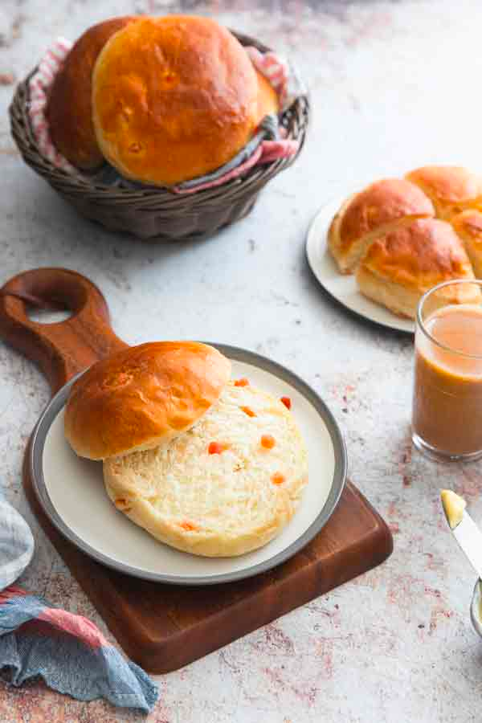

# Context

In this lab, I will use the (anonymised) data from a project that I worked on in 2019.

CK is an Indian food and beverages chain with about 19 outlets in 5 cities. Their outlets are popular "hangout" places for young and old alike. People often go to their stores for meeting their friends, family or just getting their Chai-tea or coffee. Imagine a cafe, basically.

Their prices are not low for Indian standards but they aren't a luxurious store either. They offer about 100 items at their store, though only about 20 generate most revenue.

Their two most popular items are the Chai (tea) and Coffee (which they like to call Kaapi). Chai can be of several types, depending on the spice in it. It could have ginger (Adrak) and be called Adrak Chai for example. In the table below, I'm providing some popular food items and their pictures/ details.

| Item                                                         | Description                                                                             | Picture                                     |
|------------------|------------------------|------------------------------|
| Adrak Chai / Kadak Chai / Elaichi Chai / Other types of Chai | Chai-tea with Ginger / Chai-tea with strong spices / Chai-tea with Cardamom / etc.      | {width="70%"} |
| Kulhad Chai                                                  | Chai-tea served in earthen pot. Popular in Northern India, especially New Delhi         |               |
| Indian Filter Kaapi                                          | Filter Coffee, popular in Southern India                                                | {width="70%"} |
| Paneer Puff                                                  | A croissant-like bread filled with Paneer (Indian cottage cheese)                       | {width="70%"} |
| Veg Club Sandwich                                            | Vegetarian sandwich with grated vegetables, cheese, etc.                                | {width="70%"} |
| Maska Bun                                                    | Bread and butter; commonly eaten with Chai                                              | {width="50%"} |
| Biryani                                                      | A slow-cooked rice dish made with Basmati rice, spices and choice of meat or vegetables | {width="70%"} |

# Data Analysis

## Loading Packages and Setting Working Directory

Tidyverse for manipulation and visualisation. `arules` and `arulesViz` for association rules mining and visualisation. I like the theme `theme_clean()` from `ggthemes` package.

```{r}
library(tidyverse)
library(arules)
library(arulesViz)
theme_set(ggthemes::theme_clean())
```

## Loading Data

You can load the CSV data and then convert it to a list format as required by `arules` package. It will take about 3 minutes to process.

```{r eval = FALSE}
df = read_csv("https://github.com/harshvardhaniimi/bzan-542/blob/b43cad7a71a241a0ffa11e4df369ce64fbfb54a4/Association%20Mining%20LAB/CK_data_anon.RDS") %>% 
   janitor::clean_names()

df1 = df %>% 
   select(invoice_name, item_name)


invoices = unique(df1$invoice_name)

all_items = list()

for (i in invoices)
{
   l = df1 %>% 
      filter(invoice_name == i) %>% 
      pull(item_name) %>% 
      as.character()
   
   all_items = append(all_items, list(l))
}
```

Or, you can directly import the list file I created for you after processing it.

```{r}
df = readRDS("CK_data_anon.RDS")
```

# Getting Ready for Analysis

All analysis with association rules has to be done on a list item. See `?transactions` for more details.

Converting the `df` to transactions file.

```{r}
trans = transactions(df)
```

Let's see a summary of what we have.

```{r}
summary(trans)
```

Let's look at the most frequent items. Note that on the y-axis, we have the **Support**.

```{r}
itemFrequencyPlot(trans,topN = 20)
```

Another way to visualise the data.

```{r}
ggplot(
  tibble(
    Support = sort(itemFrequency(trans, type = "absolute"), decreasing = TRUE),
    Item = seq_len(ncol(trans))
  ), aes(x = Item, y = Support)) + geom_line()
```

You can note that the most popular items are very popular and the rest of the items are not as popular.

### Number of Possible Associations

For this dataset, the number of possible associations is huge. But how much exactly?

```{r}
2^ncol(trans)
```

Woah.

## Frequent Itemsets

Let's try to find the frequent itemsets.

```{r}
its = apriori(trans, parameter=list(target = "frequent"))
its
```

**Support** is a parameter that needs to be optimised. To see all parameters that can be optimised, see `?ASparameter`.

The lower the support parameter, the higher the number of itemsets you can generate. For large datasets, you should start from higher support values and make your way down. In this case, I tried several values and found 0.1 gave me 4 itemsets, 0.01 gave me 52 itemsets, 0.005 gave me 104 itemsets, and 0.001 gave me 440 itemsets.

It will be your call to choose the right value of support.

```{r}
its = apriori(trans, parameter=list(target = "frequent", support = 0.001))
its
```

Let's see what we find.

```{r}
its = sort(its, by = "support")
inspect(head(its, n = 10))
```

Let's see how many items are brought together.

```{r}
ggplot(tibble(`Itemset Size` = factor(size(its))), aes(`Itemset Size`)) + geom_bar()
```

Most itemsets are of size two, followed by single items.

### Let's see the most popular "couples".

```{r}
inspect(its[size(its) == 2])
```

### What items are consumed in groups of three?

```{r}
inspect(its[size(its) == 3])
```

### What items are consumed in groups of four?

```{r}
inspect(its[size(its) > 3])
```

## What are the business implications of these?

-   Water 500 ml looks like its sold with a lot of items. As a business, consider adding this as a discounted pair? For example, a bottle of water costs \$5. If you buy with Chai, it will cost \$3.

## Representing Itemsets

### Maximal Itemsets

In the previously found itemsets, we included the itemsets and their supersets. However, it would not make a lot of business sense to do that.

For example, consider {Adrak Chai, Maska Bun, Water Bottle 500 ML} is one itemset. If we include this, should we also include {Adrak Chai, Water Bottle 500 ML}? Probably no.

The function `?is.maximal` keeps only those itemsets if no proper superset exists for it.

```{r}
its_max = its[is.maximal(its)]
its_max
```

Let's look at them.

```{r}
inspect(head(its_max, by = "support"))
```

## Association Rule Mining

These rules are to be interpreted as **If This Then That (IFTT)**.

```{r}
rules = apriori(trans, parameter = list(support = 0.001, confidence = 0.2))
length(rules)
inspect(head(rules))
```

### Let's see their quality

```{r}
quality(head(rules))
```

### Rules with highest lift

```{r}
rules = sort(rules, by = "lift")
inspect(head(rules, n = 10))
```

# Visualisation

You can also visualise the rules you created, thanks to `arulesViz` package.

```{r}
plot(rules)
```

Plot with order of the itemset.

```{r}
plot(rules, shading = "order")
```

### Grouped plot

```{r}
plot(rules, method = "grouped")
```

### Graph plot

```{r}
plot(rules, method = "graph")
```

There are too many rules. Let's retune the parameters for fewer rules.

```{r}
rules = apriori(trans, parameter = list(support = 0.001, confidence = 0.4))
plot(rules, method = "graph")
```

## Interactive Table and Visualisation

You can also see the rules interactively.

### Table of Rules

```{r}
inspectDT(rules)
```

### Plot of Rules

```{r}
plot(rules, engine = "html")
```

### Matrix of Rules

```{r}
plot(rules, method = "matrix", engine = "html") 
```

### Graph of Rules

```{r}
plot(rules, method = "graph", engine = "html")
```

# Single-shot Analysis

You can simply pass the data here to visualise the rules directly.

```{r eval = FALSE}
ruleExplorer(df)
```

## Reference

A large part of this tutorial follows the book chapter, [Association Analysis: Basic Concepts and Algorithms](https://mhahsler.github.io/Introduction_to_Data_Mining_R_Examples/book/association-analysis-basic-concepts-and-algorithms.html).
