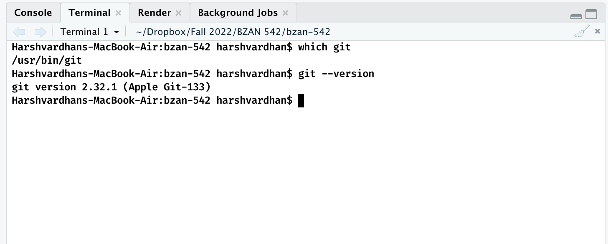
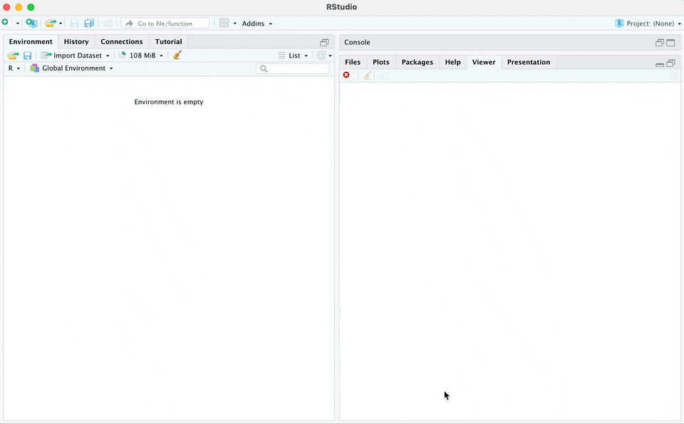
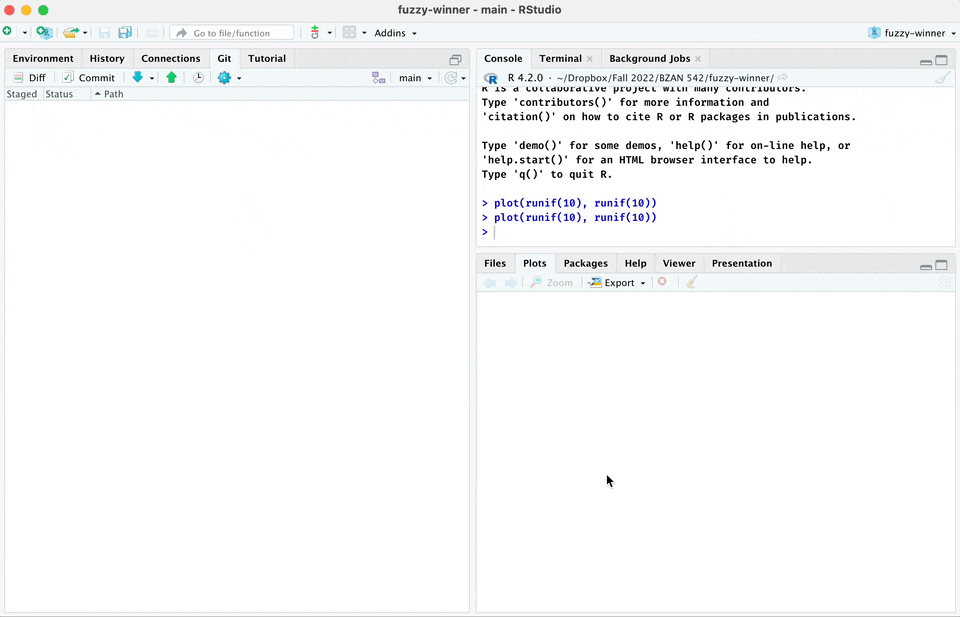

```{r xaringan-extra, echo=FALSE}
xaringanExtra::use_slide_tone()
xaringanExtra::use_progress_bar(color = "#0051BA", location = "top")
```


```{r xaringan-themer, include=FALSE, warning=FALSE}
library(xaringanthemer)
style_mono_accent(
  base_color = "#1F4257",
  header_font_google = google_font("Josefin Sans"),
  text_font_google   = google_font("Montserrat", "300", "300i"),
  code_font_google   = google_font("Fira Code")
)
```

```{r xaringan-banner, include = FALSE, echo=FALSE}
xaringanExtra::use_banner(
  #top_left = "My Awesome Talk Title",
  #top_right = "Mr. Fancy Pants",
  bottom_left = "bit.ly/my-awesome-talk",
  exclude = "title-slide"
)
```

```{r xaringanExtra-search, echo=FALSE}
xaringanExtra::use_search(show_icon = TRUE)
```


# What is GitHub?

GitHub is a software for version control.

--

**Version control:** A system to manage changes to files in a way that reverting to an old version is quick and easy.

--

.pull-left[
> Yeah, I'm thankful
>
> Scratch that, baby, I'm grateful
>
> Gotta say it's really been a while
>
> But now I got back that smile (Smile)
]

.pull-right[]

*Write. Scratch that. Rewrite.*

---

# Why use GitHub?

.pull-left[Save yourself from coffee spills, have an online backup for free]
.pull-right[]

--

.pull-left[Instead of saving copies, you make "commit". So, no more files named like
- report-final.pdf
- report-final-final.pdf
- report-v2-final.pdf]

---

# GitHub lets you time travel


---

background-image: url("github-history.gif")

---

# Branch and Merge

Things are going great. Then someone has a **wild idea**.

.center[]

## How to experiment without messing up everything?

Enter GitHub branches.

---

background-image: url("branch-and-merge.png")
background-size: contain

---

background-image: url("branch-and-merge2.png")
background-size: contain

---

class: inverse, middle, center

# How to use GitHub with RStudio?

---

# Step 1: Install Git

Go to Terminal and write `which git`

and `git --version` to see Git version



If both commands work, jump to next step. If not, install Git.

---

## MacOS

If you don't already have Git installed, writing `git --version` would present you with an offer to install Xcode command line tools. Accept the offer.

## Windows

Install Git for Windows from ["https://gitforwindows.org"](https://gitforwindows.org)

## Linux

Ubuntu or Debian Linux:

```
sudo apt-get install git
```

Fedora or RedHat Linux:

```
sudo yum install git
```

---

# Step 2: Configure Git

We will use `usethis::create_github_token()` function from `usethis` package. Recommended scope is auto-selected. .fn[1] .footnote[[1] If you don't have `usethis` and `gitcreds`, install with `install.packages(c("usethis", "gitcreds"))`]

```
usethis::create_github_token()
```

Copy the generated Personal Access Token (PAT) and leave the browser window open.

Now, open `gitcreds` with 

```
gitcreds::gitcreds_set()
```

and paste your PAT when asked for password.

Go Vols!

---

# Step 3: Create GitHub Repo

Create a new GitHub repo and copy it's link.


---

# Step 4: Create a New R Project



---

# Step 5: Create files, make changes and commit!



---

# Committing Together 🫶

Everyone can commit on the main branch directly

You will need to invite collaborators to your respository. See [Inviting collaborators to a personal repository](https://docs.github.com/en/account-and-profile/setting-up-and-managing-your-personal-account-on-github/managing-access-to-your-personal-repositories/inviting-collaborators-to-a-personal-repository)


1. On **GitHub.com**, go to your repository
2. Open repo's **Settings**
3. In the "Access" section of the sidebar, click **Collaborators & teams**.
4. Click **Invite a collaborator**.
5. Enter their email or **username**.

Your proposed collaborators will be invited to your repository. They have seven days to accept the offer.

---

# What's Next?

Branches

Pull requests

Collaboration

Private repository

GitHub Pro is free for students and educators


