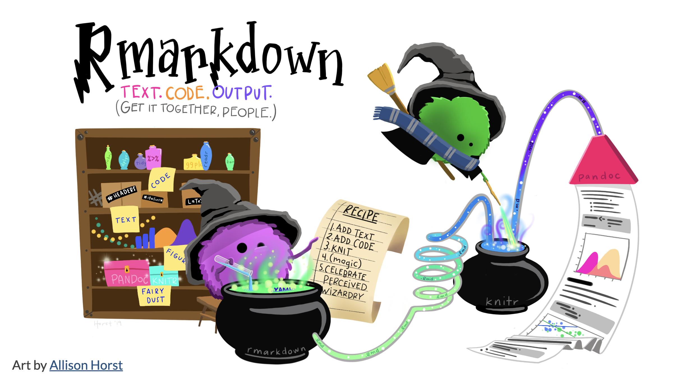

```{r setup, include=FALSE}
knitr::opts_chunk$set(echo = TRUE)
```

# What is R Markdown?

[{width="100%"}](https://www.allisonhorst.com)

R Markdown is a fantastic tool to combine your thoughts as **text**, machine language as **code**, and output in a single file!

## It can have pretty tables

```{r echo = FALSE}
mtcars |> 
   DT::datatable()
```

## It can have pretty plots

```{r, echo = FALSE}
library(ggplot2)
library(ggthemes)

cyls = as.factor(mtcars$cyl)

ggplot(mtcars, aes(x = mpg, fill = cyls)) +
  geom_density(alpha = 0.7) +
   labs(x = "Miles per gallon", y = "Density", fill = "Cylinder",
        title = "Cars with more cylinders tend to have lower mileage") +
  theme_pander() +
  theme(legend.position = "right")
```

## It can also have tweets

```{r, echo = FALSE}
tweetrmd::include_tweet("https://twitter.com/Twitter/status/1445078208190291973?s=20&t=mPaSDgxzi-nDyz4Iw0KefA")
```

Or almost anything, to be honest.

# Getting Started

The easiest way to start a R Markdown document is to start with a template. How?

Go to File -\> New File -\> R Markdown.

{width="70%"}

### Recommendation

Choose HTML Slides as default output. Or use a template.

You can choose any file with any output. You can change it all later on.

# Editing R Markdown

In my opinion, the best way is to edit using the visual editor. On the top left corner, click the "Visual" button.

If you're interested in writing markdown by hand, be my guest. Here's a quick overview.

R Markdown used Markdown for formatting. This means, you can write **bold text**, *italicized text*, `code` format, \~\~strikeout\~\~, subscripts (H~2~O), superscripts (x^2^) and many others.

Headings start with `#` and more `#` means more details.

```{r, eval = FALSE}
# Heading 1
## Heading 2
### Heading 3
#### Heading 4
```

## Equations

You can write inline math equations by enclosing them in \$\$. Like, `$5x + y^2 = \exp(x + y)$` would produce $5x + y^2 = \exp(x + y)$.

For multiline equations, enclose them in \$\$. For example,

    $$
    Y = \beta_0 + \beta_1 X
    $$

will produce

$$
Y = \beta_0 + \beta_1 X
$$

## Embed Code

Shortcut is Cmd + Option + I. The long route is to write three backticks before and after the code.

    ```{r}
    x = 5
    ```

Here I've specified `r` to say it's R code. It could be Python, Julia, Fortran and [many other languages](https://bookdown.org/yihui/rmarkdown/language-engines.html).

## Lists

There are two types of lists: ordered and unordered. To write an ordered list, start by numbering the points. The number doesn't matter --- in fact, they can all be 1!

    1.  Don't be afraid to ask a question that may sound stupid because 99% of the time everyone else is thinking of the same question and is too embarrassed to ask it.

    2.  Extraordinary claims should require extraordinary evidence to be believed.

    3.  Everyone is shy. Other people are waiting for you to introduce yourself to them, they are waiting for you to send them an email, they are waiting for you to ask them on a date. Go ahead.

This will produce:[^1]

[^1]: These points are from Kevin Kelly's [68 Bits of Unsolicited Advice](https://kk.org/thetechnium/68-bits-of-unsolicited-advice/).

1.  Don't be afraid to ask a question that may sound stupid because 99% of the time everyone else is thinking of the same question and is too embarrassed to ask it.
2.  Extraordinary claims should require extraordinary evidence to be believed.
3.  Everyone is shy. Other people are waiting for you to introduce yourself to them, they are waiting for you to send them an email, they are waiting for you to ask them on a date. Go ahead.

Unordered lists are the same. Except that they start with a dash (-).

    - Pros are just amateurs who know how to gracefully recover from their mistakes.
    - Don’t trust all-purpose glue.
    - Never get involved in a land war in Asia.

-   Pros are just amateurs who know how to gracefully recover from their mistakes.
-   Don't trust all-purpose glue.
-   Never get involved in a land war in Asia.

### Additional Resource

Check out R Studio's [guide](https://rstudio.github.io/visual-markdown-editing/) on Visual Editor. The [Technical Writing](https://rstudio.github.io/visual-markdown-editing/technical.html) and [Content Editing](https://rstudio.github.io/visual-markdown-editing/content.html) parts are super-useful.

## Chunk Options

When you start working with R Markdown files, you will find find some things mildly annoying. Like how warnings and messages show up again and again. Like this.

```{r}
library(tidyverse)
```

You may want to hide the code, the messages, the output and many more. How? Chunk options.

Here's an example where I'm hiding the code, the warnings and the message. So, only the plot is visible.

```{r, echo=FALSE, warning=FALSE, message=FALSE}
theme_set(ggthemes::theme_pander())
mtcars |> 
   ggplot(aes(x = mpg, y = disp, colour = factor(cyl), shape = factor(gear))) +
   geom_point(size = 5, alpha = 0.7)
```

Here are some important chunk options.

| Chunk          | What it does                                                                                                                                                                    |
|-------------------------|----------------------------------------------|
| eval = TRUE    | Evaluates the code chunk. If set to FALSE, the code will not run when the document is knitted.                                                                                  |
| echo = TRUE    | Whether to display the source code in the output document. TRUE means show the codes.                                                                                           |
| warning = TRUE | Whether to display code warnings in the output document. TRUE means show the warnings.                                                                                          |
| message = TRUE | Whether to display code messages in the output document. TRUE means show the messages.                                                                                          |
| include = TRUE | Whether to include the code chunk in the output document. The code will still run, but will not show codes, warnings or messages. [I should be using this in the last example.] |
| tidy = TRUE    | Reformat code using appropriate conventions. We all write clumsy codes, this is the way to make it 🚀.                                                                          |

There are many many more options. For a comprehensive list, see Yihui Xie's blog: <https://yihui.org/knitr/options/>.

## Infinite Moon Reader

It is difficult to avoid the urge to edit the file and see the output at the same time. For such "live editing" experience, use Infinite Moon Reader from `xaringan` package. For more details, see [infinite moon reader](http://jenrichmond.rbind.io/post/infinite-moon-reader/).

# Making it Pretty

An important part of presentation is making it pretty. The easiest way to achieve it is by using themes.

## Default Themes


## Distill Themes

This is my favourite one. It quickly makes a document look professional! [Distill](https://rstudio.github.io/distill/) is designed for scientific publishing. To use it, change your YAML output format to `distill::distill_article`.

    output: 
       distill::distill_article:
         toc: yes

```{r, echo=FALSE}
tweetrmd::include_tweet("https://twitter.com/apreshill/status/1101866080996212736")
```

## Other Themes

Many other packages like [prettydoc](https://cran.r-project.org/web/packages/prettydoc/vignettes/tactile.html), [rmdformats](https://github.com/juba/rmdformats) and [hrbrthemes](https://github.com/hrbrmstr/hrbrthemes) provide ready to use themes. This document uses rmdformat's `robodoc` format.

# Sharing on Short Notice

You are working on a group project and come with an excellent idea. You write that into an article with R Markdown. Now you want to share it widely starting with your teammates. How?

You can email the HTML file. Or knit it to PDF and share that with anyone. But the best option is [Netlify Drop](https://app.netlify.com/drop).

[](https://app.netlify.com/drop)

As long as your R Markdown file is named `index.Rmd` which will produce an `index.html`, all you need to do is to drop the folder in that circle!

Try it. It's really that simple.

Note that the site will be deleted in 24 hours if you do not create a Netlify account. Depending on your usecase, I'd suggest making an account.

# Beyond Reports

R Markdown is [quite versatile](https://rmarkdown.rstudio.com/lesson-9.html). Producing reports is not the only usecase. In fact, it can be used for making websites and blogs, writing books, and more. The output can be HTML, PDF, EPUB, MOBI, Microsoft Word, Microsoft Powerpoint, and more.

For example, I maintain [my website](https://www.harsh17.in) almost exclusively using R and R Markdown. There is a huge collection of [books](https://www.bigbookofr.com) written with R Markdown. [Here is Rob Hyndman](https://www.youtube.com/watch?v=_D-ux3MqGug) to convince you further.

```{r, echo=FALSE}
vembedr::embed_youtube("https://youtu.be/_D-ux3MqGug")
```
